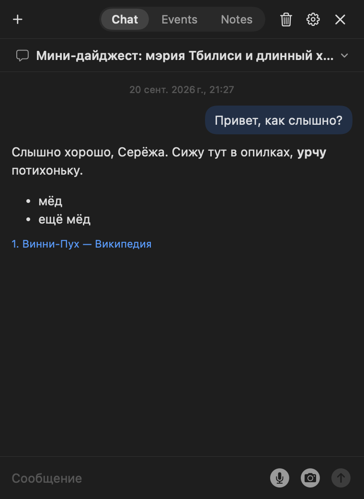
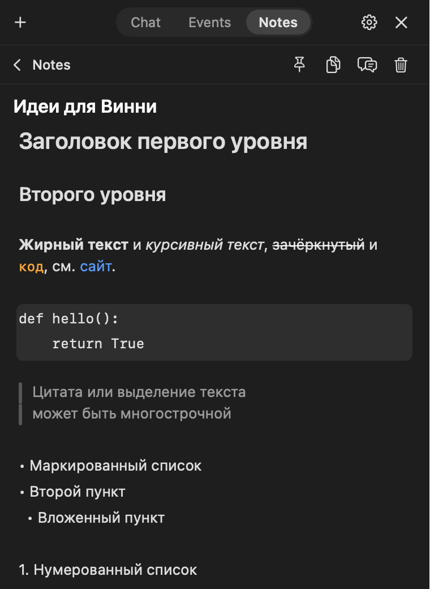

<p align="center">
  
</p>

# Winnie

Персональный десктоп-питомец для macOS: Винни-Пух живёт поверх всех окон, а по клику открывает
карманный чат на Claude API. Нужен для быстрых одноразовых дел — перевести, найти, напомнить,
записать — без переключения в браузер.

Личный проект: собирается из исходников, готовых сборок нет.

<p align="center">
  
  
  
</p>

## Что умеет

**Питомец**
- Плавает поверх всех окон и пространств, перетаскивается, меняет размер
- Состояния: покой, наведение, раздумье, речь, слушает, ошибка, перетаскивание; через минуту без дела засыпает и видит сны
- Перекур в 16:20 (и по просьбе в чате)
- Значок в строке меню, глобальные шорткаты: `⌃⌥Space` — показать/спрятать, `⇧⌘E` — диктовка

**Чат**
- Claude Opus 5 / Sonnet 5 / Haiku 4.5, стриминг, Markdown, веб-поиск
- Несколько чатов с автоназваниями, хранение 30 дней
- Скриншот области экрана и вставка картинок из буфера
- Голосовой ввод и озвучка ответов встроенными средствами macOS (бесплатно, распознавание на устройстве)
- Быстрые действия — свои кнопки с инструкциями
- Редактируемый мастер-промпт, память («запомни, что…»), учёт расходов по моделям

**События и заметки**
- Напоминания обычным языком («напомни завтра в 10»), разовые и повторяющиеся, системные уведомления
- Заметки в Markdown-файлах: редактор без видимой разметки, меню по `/`, чекбоксы, картинки, закрепление
- Упоминания заметок и событий в сообщении через `@`

**Интеграции**
- Gmail — только чтение (OAuth, scope `gmail.readonly`)
- Telegram-бот: тот же Винни в телефоне, пока приложение запущено на Mac
- MCP-серверы (включая OAuth) и произвольные HTTP-API с привязкой к хосту
- Винни управляет собственными настройками из чата («стань побольше», «добавь кнопку…»)

## Требования

- macOS 14 или новее (проверено на macOS 15, Apple Silicon)
- Command Line Tools (`xcode-select --install`); Xcode не нужен
- Ключ Anthropic API — [console.anthropic.com](https://console.anthropic.com/)

## Установка

```bash
git clone https://github.com/nel-feelingood/winnie.git
cd winnie
./scripts/install.sh
```

Скрипт собирает релиз, подписывает, кладёт `Winnie.app` в `/Applications` и запускает его.
При первом запуске откроются настройки — вставь ключ API в разделе «API».

### Подпись

Если в Связке ключей есть самоподписанный сертификат для подписи кода с именем **Winnie Dev**,
скрипт подпишет им — тогда разрешения macOS (Связка ключей, микрофон, запись экрана) переживают
пересборки. Без него подпись ad-hoc, и система будет переспрашивать после каждой сборки.

Создать: Связка ключей → Ассистент сертификации → Создать сертификат → имя `Winnie Dev`,
тип «Самоподписанный корневой», «Подпись кода».

### Разрешения macOS

| Разрешение | Зачем |
|---|---|
| Уведомления | Напоминания |
| Микрофон и распознавание речи | Диктовка |
| Запись экрана | Скриншоты из чата |

### Подключения (необязательно)

Всё настраивается в приложении, разделы «API» и «MCP»:

- **Gmail** — нужен свой OAuth-клиент типа Desktop в Google Cloud с включённым Gmail API. Пока проект в статусе Testing, Google просит входить заново раз в 7 дней
- **Telegram** — создай бота у [@BotFather](https://t.me/BotFather), вставь токен, отправь боту шестизначный код из настроек
- **MCP и свои API** — адрес и, при необходимости, токен; для MCP с OAuth вход открывается в браузере

## Разработка

```bash
swift test                                        # тесты ядра
./scripts/build-app.sh                            # только собрать build/Winnie.app
swift run WinnieSnapshot out.png [chat|empty|events|notes|note|mention|confirm|mail|settings-<раздел>]
swift run WinnieSnapshot /dev/null editor-test    # поведение и скорость редактора заметок
swift scripts/add-sprite.swift картинка.png состояние [--colour-only] [--bounds-from другая.png]
swift scripts/import-sprites.swift                # разложить спрайты в папку приложения
```

`WinnieSnapshot` рисует настоящие окна приложения в PNG с тестовыми данными — так вёрстка
проверяется без доступа к экрану. Скриншоты в этом README сделаны им же.

### Устройство

| Каталог | Что в нём |
|---|---|
| `Sources/WinnieCore` | Логика без AppKit: API-клиент, хранилища, инструменты модели, разбор Markdown. Покрыта тестами |
| `Sources/WinnieApp` | Окна, меню, чат, редактор заметок, голос, интеграции |
| `Sources/Winnie` | Исполняемая оболочка в одну строку |
| `Sources/WinnieSnapshot` | Утилита снимков и проверок редактора (только debug) |
| `Tests/WinnieCoreTests` | Тесты ядра (swift-testing) |
| `Assets` | Оригиналы спрайтов и иконок |
| `docs` | [Принятые решения](docs/design.md), [промпт для спрайтов](docs/sprite-prompt.md) |

Единственная зависимость — [swift-markdown-ui](https://github.com/gonzalezreal/swift-markdown-ui).
С Claude API приложение говорит напрямую по HTTP и SSE.

## Данные и безопасность

- Чаты, события, заметки, память и статистика лежат локально в `~/Library/Application Support/Winnie/`
- Секреты (ключ Anthropic, OAuth-токены, токен бота) хранятся только в Связке ключей, сервис `local.winnie.pet`; в репозитории и в файлах настроек их нет
- Наружу уходит только то, что ты отправляешь в чат, — в Anthropic API и в подключённые тобой сервисы
- Защита от инъекций: после того как в ответ попало письмо, веб-страница или данные MCP/API, инструменты, меняющие память, настройки и заметки, в этом ответе блокируются
- Telegram-бот отвечает только в личном чате, привязанном кодом; после пяти неверных кодов код меняется

## Известные ограничения

- Код внутри строки в заметке выделяется цветом, без подложки
- Распознавание речи настроено на русский
- Telegram-бот принимает только текст

## Лицензия

Исходный код — [MIT](LICENSE), © Sergey Donskov.

Лицензия не распространяется на изображения в `Assets`: Винни-Пух — персонаж фильмов Фёдора Хитрука
(«Союзмультфильм»), спрайты нарисованы для личного использования. Для своей сборки можно нарисовать
собственные по [промпту](docs/sprite-prompt.md).
